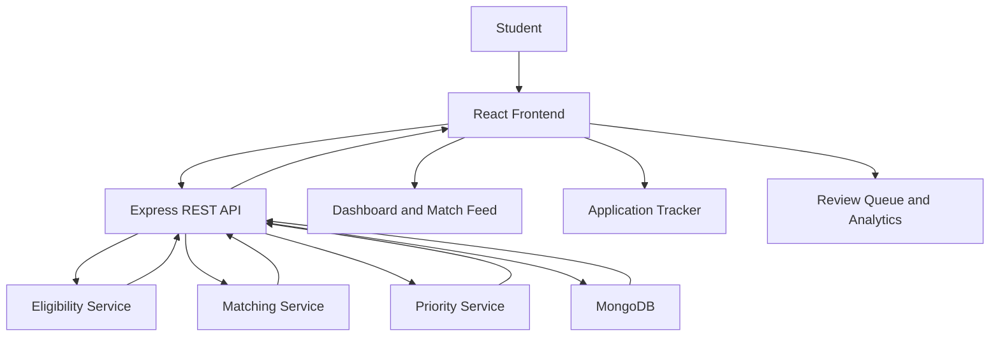

# ApplyPilot 🚀

### Internship Discovery, Eligibility Matching & Application Tracking

ApplyPilot is a student-focused platform designed to simplify internship discovery and application management. It helps students evaluate opportunities against their academic profile and skills, understand eligibility and skill gaps, save relevant opportunities, and track application progress in one place.

## 🎯 Problem Statement

Students searching for internships face fragmented listings, unclear eligibility requirements, repeated manual research, and difficulty tracking applications across multiple platforms. These challenges waste time and can cause students to miss relevant opportunities and deadlines.

## 💡 Our Solution

ApplyPilot combines backend-powered opportunity matching, eligibility assessment, skill-gap insights, and application tracking in one workflow. Students can explore opportunities, inspect their match results, save suitable roles, update application statuses, maintain notes, and monitor their progress through a unified dashboard.

## ✨ Features

### 1. Opportunity Dashboard

* View opportunities from the connected dataset.
* Review eligibility results, match scores, and priority levels.
* Explore matched and missing skills.
* Search and filter opportunities by available attributes.
* Save opportunities to the application tracker.

### 2. Opportunity Details

* Inspect opportunity descriptions and extracted skill requirements.
* Review eligibility checks and match scores.
* Identify skills that match the configured student profile.
* Distinguish demo content from opportunities loaded through the backend.

### 3. Application Tracker

* Save opportunities for later.
* Track application statuses:

  * Saved
  * Applied
  * Interview
  * Rejected
  * Offer
* Add and update notes.
* Remove tracked applications.
* Persist application records and updates in MongoDB.

### 4. Match Feed

* Review opportunity-matching results.
* Compare match scores and eligibility.
* Inspect matched and missing skills.
* Save suitable opportunities for tracking.

### 5. Application Review Queue

* Review saved opportunities before applying.
* Organize the next steps for an application.
* Mark an application as Applied after submitting through the employer's process.

**Note:** This is a manual application workflow. ApplyPilot does not automatically submit job applications.

### 6. Analytics Dashboard

* Review total opportunities and eligible opportunities.
* See tracked application counts.
* View average match scores.
* Monitor the current distribution of application statuses.

Analytics are based on current records, not historical conversion rates.

## 🛠️ Technology Stack

| Layer             | Technologies                |
| ----------------- | --------------------------- |
| Frontend          | React 19, Vite              |
| Routing           | React Router                |
| Styling           | Tailwind CSS                |
| UI and animation  | Framer Motion, Lucide React |
| Frontend state    | Zustand                     |
| Backend           | Node.js, Express.js         |
| Database          | MongoDB, Mongoose           |
| API communication | REST APIs using Fetch       |
| Development       | Git, GitHub                 |

## 🏗️ Architecture



### Application Workflow

1. The frontend requests opportunity results from the Express backend.
2. The backend retrieves opportunity data and evaluates eligibility, skill matching, and priority using the implemented services.
3. The frontend displays the results and allows students to review opportunities.
4. When a student saves an opportunity, the frontend calls the application-tracking API.
5. Express and Mongoose store the application record in MongoDB.
6. Status changes and notes are persisted and displayed in the tracker.
7. Analytics derives current metrics from the opportunity and application data.

## 🔌 API Endpoints

| Method | Endpoint                                | Purpose                                   |
| ------ | --------------------------------------- | ----------------------------------------- |
| GET    | `/api/health`                           | Check backend health                      |
| GET    | `/api/opportunities/eligible`           | Retrieve eligibility and matching results |
| GET    | `/api/applications`                     | Retrieve tracked applications             |
| POST   | `/api/applications/:opportunityId/save` | Save an opportunity                       |
| PATCH  | `/api/applications/:applicationId`      | Update status and notes                   |
| DELETE | `/api/applications/:applicationId`      | Remove an application                     |

The opportunity-matching endpoint accepts profile query parameters such as graduation year, branch, CGPA, and skills.

## 📦 Getting Started

### Prerequisites

* Node.js and npm
* MongoDB, either locally or through a hosted deployment
* Git

### 1. Clone the repository

```bash
git clone https://github.com/lalith-h-15/applypilot.git
cd applypilot
```

### 2. Configure and run the backend

```bash
cd backend
npm install
```

Create a `backend/.env` file and configure the MongoDB connection and any other environment variables required by `backend/config/db.js`.

Then start the development server:

```bash
npm run dev
```

The backend uses port `5000` by default unless overridden by its environment configuration.

### 3. Configure and run the frontend

Open a second terminal:

```bash
cd frontend
npm install
npm run dev
```

If needed, configure `VITE_API_URL` in the frontend environment to point to the backend base URL, for example:

```env
VITE_API_URL=http://localhost:5000
```

Open the local URL printed by Vite.

### 4. Build the frontend

From the `frontend` directory:

```bash
npm run build
```

The production build is generated in `frontend/dist`.

## 🧪 Current Implementation Status

ApplyPilot's MVP includes the React dashboard, backend opportunity matching and eligibility workflow, MongoDB-backed application tracking, status and notes updates, opportunity details, a review queue, and analytics views.

The current matching workflow uses configured profile data and backend services. The default demonstration profile represents a CSE student graduating in 2029, with a configured CGPA and skill set.

### Current Limitations

* The student profile is configured demo data rather than a fully personalized account profile.
* Opportunity listings come from the connected dataset; live job scraping and continuous listing verification are not implemented.
* The opportunity-detail page includes mock routes for demonstrating UI states.
* The current MVP does not include a separately trained machine-learning model, an LLM/RAG pipeline, or an AI-agent system.
* The application review queue does not automatically submit applications.
* Analytics reports current application states rather than historical conversion trends.
* Authentication and production-grade multi-user access controls require further development.

## 🛣️ Future Improvements

* Live opportunity discovery through permitted data sources and official career pages.
* Source links, deadline validation, and listing freshness indicators.
* Personalized student profiles and secure authentication.
* AI-assisted resume tailoring, cover-letter drafts, and interview preparation.
* Deadline reminders and follow-up notifications.
* Historical application funnel analytics.
* Improved testing, deployment, and production security.

## 🌟 Project Vision

ApplyPilot aims to make internship discovery more organized, transparent, and actionable by helping students understand their eligibility, identify skill gaps, and manage applications throughout their career journey.

**Built to help students spend less time organizing applications and more time preparing for opportunities.**
